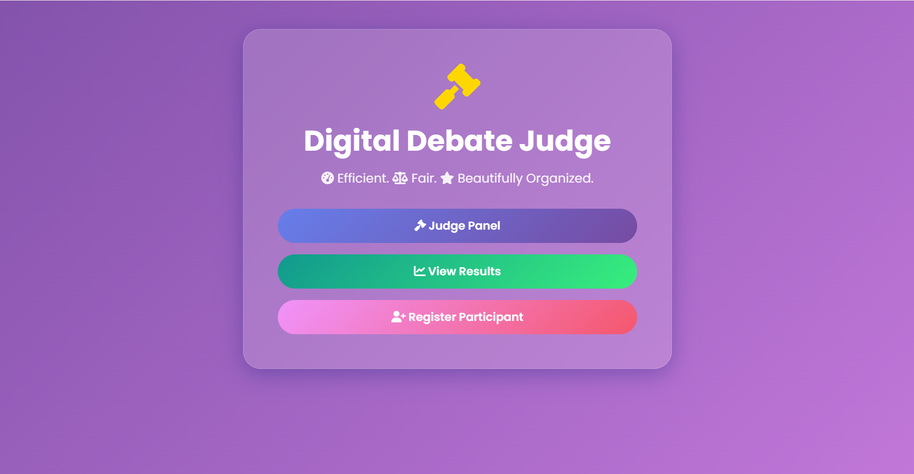
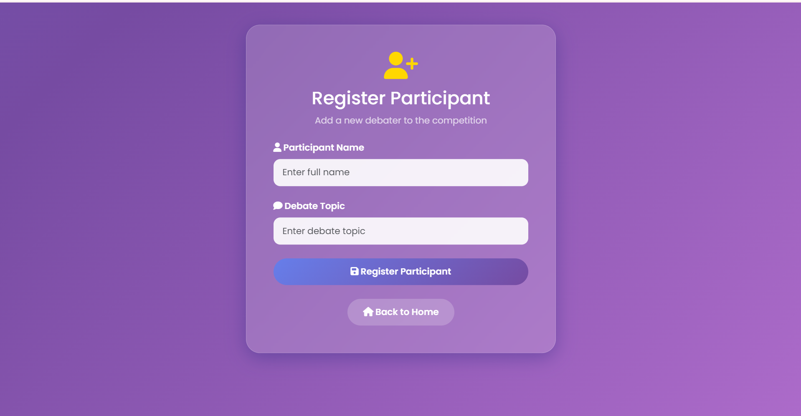
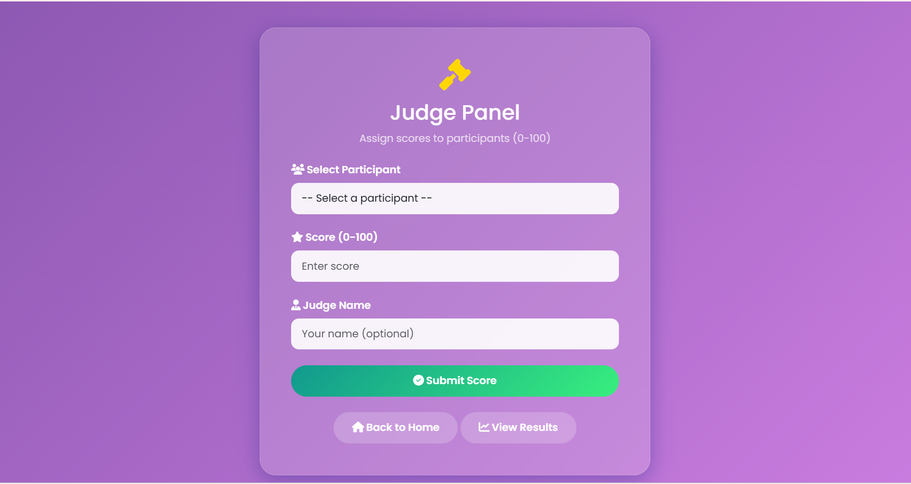

# 🏆 Digital Debate Judge

[](https://flask.palletsprojects.com/)
[](https://sqlite.org/)
[](https://getbootstrap.com/)
[](LICENSE)
[](https://python.org)

> A modern, glassmorphism-style web application for organizing and judging debates. Built with Flask, SQLite, and Bootstrap 5.

---

## ✨ Features

| Feature                           | Description                                 |
| --------------------------------- | ------------------------------------------- |
| 📝 **Register Participants**      | Add participants with name and debate topic |
| 🎤 **Judge Panel**                | Judges can assign scores (0–100)            |
| 📊 **Results Leaderboard**        | Participants ranked by score                |
| 🗑️ **Delete Participants**       | Remove participants when needed             |
| 🎨 **Glassmorphism UI**           | Modern design with animated gradients       |
| 📱 **Responsive Design**          | Works on desktop, tablet, and mobile        |
| 🔒 **Secure Database Operations** | Parameterized queries prevent SQL injection |

---

## 🖼️ Screenshots

|           Home Page           |             Register Page             |
| :---------------------------: | :-----------------------------------: |
|  |  |

|           Judge Panel           |                     Results                     |
| :-----------------------------: | :---------------------------------------------: |
|  |  |

---

## 🛠️ Tech Stack

| Category       | Technology                         |
| -------------- | ---------------------------------- |
| **Backend**    | Python, Flask                      |
| **Database**   | SQLite                             |
| **Frontend**   | HTML5, CSS3, Bootstrap 5           |
| **Icons**      | Font Awesome                       |
| **Animations** | Typed.js, CSS Keyframes            |
| **Styling**    | Glassmorphism UI, Gradient Effects |

---

## 📂 Project Structure

```bash
digital-debate-judge/
│
├── app.py
├── debate.db
│
├── templates/
│   ├── base.html
│   ├── home.html
│   ├── register.html
│   ├── judge_panel.html
│   └── results.html
│
└── screenshots/
    ├── home.png
    ├── register.png
    ├── judge.png
    └── Debate Results .png
```

---

## 🚀 Installation & Setup

### Prerequisites

* Python 3.11+
* pip

### Step 1: Clone Repository

```bash
git clone https://github.com/Sara12-2/Digital_Debate_judge_web_development_project.git
cd Digital_Debate_judge_web_development_project
```

### Step 2: Create Virtual Environment

```bash
# Windows
python -m venv venv
venv\Scripts\activate

# Mac/Linux
python3 -m venv venv
source venv/bin/activate
```

### Step 3: Install Flask

```bash
pip install flask
```

### Step 4: Run Application

```bash
python app.py
```

### Step 5: Open Browser

```text
http://127.0.0.1:5000
```

---

## 🌐 Usage Guide

| Page           | URL         | Action                         |
| -------------- | ----------- | ------------------------------ |
| 🏠 Home        | `/`         | Navigate to different sections |
| 📝 Register    | `/register` | Add new participants           |
| 🎤 Judge Panel | `/judge`    | Assign scores (0–100)          |
| 📊 Results     | `/results`  | View leaderboard               |

---

## 🔒 Security Features

| Feature                  | Status                            |
| ------------------------ | --------------------------------- |
| SQL Injection Protection | ✅ Parameterized Queries           |
| Input Validation         | ✅ Name, Topic & Score Validation  |
| Session Management       | ✅ Flask Sessions                  |
| CSRF Protection          | ⚠️ Recommended for Future Updates |

---

## 🐛 Troubleshooting

| Issue              | Solution                  |
| ------------------ | ------------------------- |
| Flask not found    | Run `pip install flask`   |
| Port 5000 in use   | Change port in `app.py`   |
| Database locked    | Restart Flask server      |
| Template not found | Check `templates/` folder |

---

## 🚀 Future Improvements

* 🤖 AI-Powered Debate Evaluation (GPT Integration)
* 👥 Multi-Judge System with Average Scoring
* 📊 Analytics Dashboard using Chart.js
* ⚡ Real-Time Updates using WebSockets
* 🔐 User Authentication (Admin & Judges)
* 📥 CSV/PDF Export System
* 📧 Email Notifications

---

## 📄 License

This project is licensed under the **MIT License**.

---

## 🙏 Acknowledgments

* **Flask** – Lightweight Python Web Framework
* **Bootstrap** – Responsive Frontend Components
* **Font Awesome** – Beautiful Icons
* **Typed.js** – Animated Typing Effects

---

## 📧 Contact

**Developer:** Sara Manzoor

**GitHub:** @Sara12-2

**LinkedIn:** Sara Manzoor

---

### ❤️ Built with Passion by Sara Manzoor

**Digital Debate Judge**
